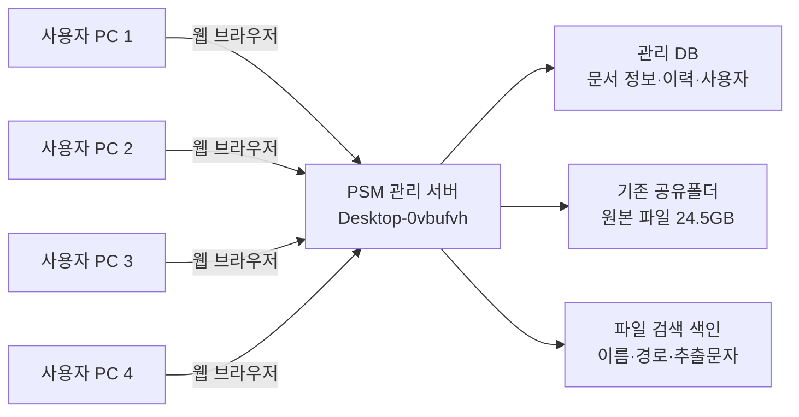
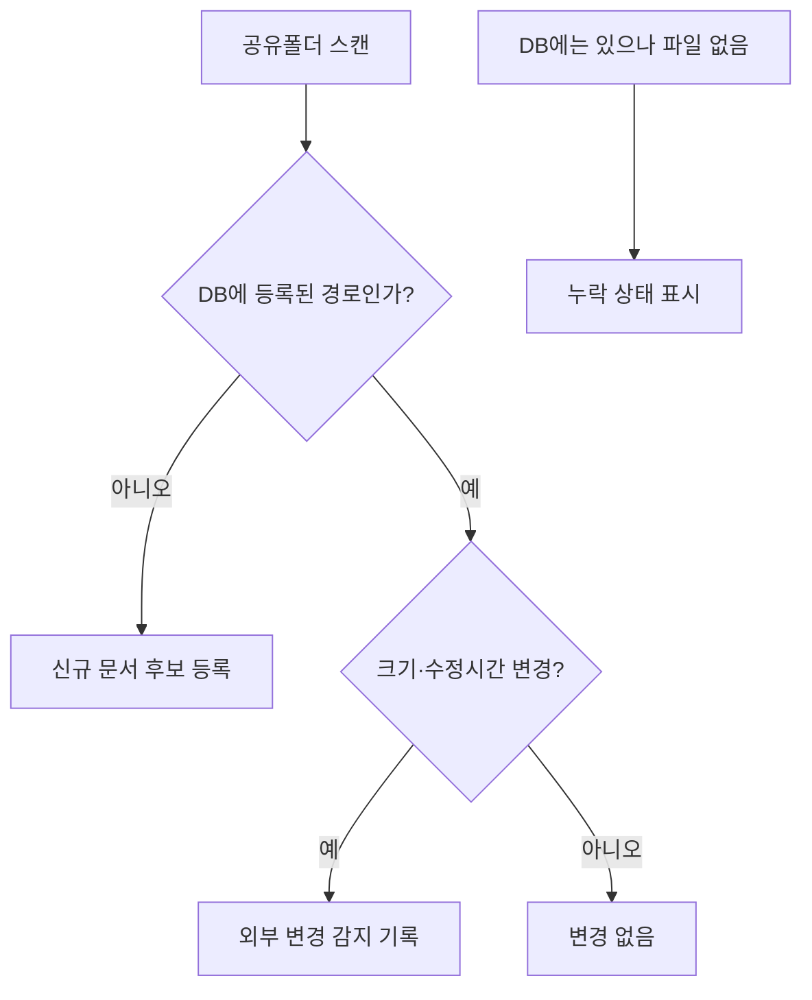

# PSM 문서관리시스템 1차 설계안

## 1. 구축 목적

현재 `\\Desktop-0vbufvh\esq공유폴더`에 보관 중인 PSM 문서를 이동하거나 복제하지 않고, 기존 공유폴더 위에 문서 검색, 최신본 관리, 담당자 관리, 검토 일정, 변경 이력을 제공하는 사내용 웹 시스템을 구축한다.

현재 확인된 규모는 전체 공유폴더 기준 약 5,176개 파일, 24.5GB이며 주요 형식은 JPG, PDF, XLSX, HWP, DWG, DOC 계열이다. 1차 구축 대상은 `1.PSM` 폴더로 제한한다.

## 2. 핵심 원칙

1. 원본 파일은 기존 공유폴더에 그대로 보관한다.
2. 프로그램은 파일의 위치와 관리정보만 별도 데이터베이스에 저장한다.
3. 사용자 PC는 데이터베이스나 공유파일을 직접 수정하지 않고 관리 서버를 거친다.
4. 프로그램 외부에서 파일을 추가하거나 이름을 바꿔도 자동 스캔으로 반영한다.
5. 파일 내용 자체의 공동편집보다 최신본 식별과 변경 이력 관리에 우선순위를 둔다.

## 3. 사용자 구성

| 권한 | 대상 | 가능 작업 |
|---|---|---|
| 관리자 | 안전관리 책임자 1명 | 사용자 관리, 분류 설정, 전체 수정, 강제 잠금 해제, 스캔 실행 |
| 편집자 | 실무 담당자 3명 | 문서 등록, 관리정보 수정, 검토 완료, 새 버전 등록 |
| 조회자 | 향후 추가 사용자 | 검색, 미리보기, 다운로드, 이력 조회 |

초기에는 4개 계정을 발급하며 계정별 이름을 변경 이력에 기록한다.

## 4. 전체 구성



- 접속주소 예시: `http://Desktop-0vbufvh:3000/psm`
- 관리 서버: 기존 Node.js/Express 서버에 PSM 모듈 추가
- 관리 DB: 서버 로컬 SQLite 사용 후 정기 백업
- 원본 저장소: `\\Desktop-0vbufvh\esq공유폴더\1.PSM`
- 브라우저: Edge 또는 Chrome

중요: SQLite 파일을 네트워크 공유폴더에 두지 않는다. 서버 프로세스만 DB를 열고 4명의 요청을 순서대로 처리한다.

## 5. 메뉴 구조

```text
PSM 문서관리
├─ 대시보드
├─ 문서함
│  ├─ 오영
│  ├─ 에스이엠
│  ├─ 자체감사
│  ├─ P&ID / PFD
│  └─ 전체 배치도
├─ 검토 및 갱신
├─ 변경 이력
├─ 휴지통/누락 파일
└─ 시스템 관리
   ├─ 사용자 관리
   ├─ 분류 및 태그
   ├─ 폴더 스캔
   └─ 백업 상태
```

## 6. 주요 화면

### 6.1 대시보드

```text
┌────────────────────────────────────────────────────────────────────┐
│ PSM 문서관리                 [통합검색____________]  홍길동 ▾      │
├──────────────┬─────────────────────────────────────────────────────┤
│ 대시보드     │ 전체 1,240  최신본 1,105  검토예정 18  누락 3     │
│ 문서함       ├─────────────────────────────────────────────────────┤
│ 검토 및 갱신 │ [검토기한 임박]             [최근 변경 문서]       │
│ 변경 이력    │ 4.4 도급업체 안전관리 D-7   위험물질 목록 수정     │
│ 시스템 관리  │ 안전운전지침 D-21            배치도 PDF 등록        │
│              ├─────────────────────────────────────────────────────┤
│              │ 회사별 문서 현황  |  PSM 항목별 누락 현황          │
└──────────────┴─────────────────────────────────────────────────────┘
```

대시보드는 파일 개수보다 업무상 조치가 필요한 항목을 먼저 보여준다.

### 6.2 문서함

```text
┌────────────────────────────────────────────────────────────────────┐
│ 문서함 > 오영 > 4.0 안전운전계획                                  │
│ [검색________] [회사▼] [PSM 항목▼] [상태▼] [담당자▼] [+ 문서등록] │
├────────────────────────────────────────────────────────────────────┤
│ 상태   문서명                    개정일      담당자  검토일   형식 │
│ 최신   4.4 도급업체 안전관리     2026-06-05  김OO    2027-06  HWP  │
│ 검토   안전작업허가서 지침        2025-08-08  이OO    D-14     PDF  │
│ 구버전 도급업체 안전관리_2024     2024-05-10  김OO    -        HWP  │
└────────────────────────────────────────────────────────────────────┘
```

행을 선택하면 우측 상세 패널에서 다음 정보를 표시한다.

- 원본 파일 열기, 폴더 열기, 다운로드
- 문서번호, 회사, PSM 대분류/세부분류
- 최신본 여부와 이전 버전 목록
- 담당자, 승인자, 개정일, 다음 검토일
- 태그와 메모
- 파일 크기, 실제 경로, 마지막 파일 수정일
- 등록·수정·열람 이력

### 6.3 문서 상세 및 새 버전 등록

새 버전 등록 시 기존 파일을 덮어쓰지 않는다.

1. 새 파일을 선택한다.
2. 개정 사유와 개정일을 입력한다.
3. 서버가 정해진 폴더에 파일을 저장한다.
4. 기존 문서는 `구버전`, 새 문서는 `최신본`으로 표시한다.
5. 등록자와 시간이 변경 이력에 남는다.

기존 파일을 직접 열어 수정한 경우 다음 스캔에서 크기 또는 수정시간 변화를 감지해 `외부 변경 감지` 상태로 표시한다.

## 7. PSM 분류 체계

기존 폴더명은 그대로 보존하고 관리용 표준분류를 별도로 연결한다.

| 코드 | 대분류 예시 |
|---|---|
| PSM-01 | 공정안전자료 |
| PSM-02 | 공정위험성평가 |
| PSM-03 | 안전운전계획 |
| PSM-04 | 비상조치계획 |
| AUDIT | 자체감사 및 시정조치 |
| DRAWING | P&ID, PFD, 배치도 |
| ETC | 평가자료 및 기타 |

폴더 경로만으로 분류가 가능한 문서는 자동 분류하고, 애매한 문서만 사용자가 선택한다.

## 8. 데이터 구조

### documents

| 필드 | 설명 |
|---|---|
| id | 문서 고유번호 |
| title | 화면에 표시할 문서명 |
| file_path | 공유폴더 기준 상대경로 |
| company | 오영, 에스이엠, 공통 |
| category_code | PSM 표준분류 코드 |
| document_no | 사내 문서번호, 선택값 |
| version | 개정번호 또는 버전 |
| status | 최신, 구버전, 검토필요, 누락, 보관 |
| owner_user_id | 담당자 |
| revision_date | 개정일 |
| review_due_date | 다음 검토일 |
| file_size | 파일 크기 |
| file_modified_at | 실제 파일 수정시간 |
| file_hash | 동일파일 및 외부변경 확인값 |
| parent_document_id | 이전 버전과 연결 |
| created_at / updated_at | 등록·수정시간 |

추가 테이블은 `users`, `categories`, `tags`, `document_tags`, `audit_logs`, `scan_results`, `file_locks`로 구성한다.

## 9. 검색 설계

### 1차 검색

- 파일명
- 폴더명과 전체 경로
- 회사, PSM 항목, 담당자, 상태, 연도, 확장자
- 문서 메모와 태그

### 2차 검색

- PDF와 DOCX 본문 검색
- XLSX 시트 내 문자열 검색
- 이미지 OCR 검색

HWP와 DWG 본문 검색은 변환도구와 라이선스 검토가 필요하므로 1차에서는 파일명·경로 검색만 지원한다.

## 10. 동시 사용과 파일 잠금

- 목록과 관리정보는 4명이 동시에 사용할 수 있다.
- 사용자가 `편집 시작`을 누르면 문서에 임시 잠금을 건다.
- 다른 사용자는 편집자 이름과 시작시간을 볼 수 있다.
- Word, Excel, 한글 프로그램에서 직접 연 파일의 실제 잠금 여부도 가능한 범위에서 확인한다.
- 잠금은 일정 시간 후 만료되며 관리자가 해제할 수 있다.
- 프로그램 밖에서 같은 파일을 동시에 편집하는 문제까지 완전히 차단할 수는 없으므로 최신본 등록 절차를 기본 업무방식으로 정한다.

## 11. 파일 스캔

서버는 최초 전체 스캔 후 5분 간격으로 변경분을 확인한다.



파일을 자동 삭제하거나 자동 이동하지는 않는다. 모든 위험한 작업은 사용자 확인 후 수행한다.

## 12. 백업과 복구

- 원본 문서: 현재 공유폴더 백업 정책 유지, 별도 외장/NAS 백업 권장
- 관리 DB: 매일 새벽 자동 백업, 최근 30일 보관
- 설정 및 이력: DB 백업에 포함
- 월 1회 복구 시험
- 서버 PC 교체 시 공유폴더 경로와 DB 백업만 연결하면 복구 가능하도록 구성

## 13. 1차 구축 범위

### 포함

- 4인 로그인과 권한
- `1.PSM` 전체 파일 자동 등록
- 폴더 트리와 문서 목록
- 파일명·경로 통합검색 및 필터
- 원본 파일/폴더 열기
- 담당자, 상태, 개정일, 검토일, 태그 관리
- 최신본/구버전 연결
- 검토기한 알림 대시보드
- 변경 이력
- 수동/자동 폴더 스캔
- DB 자동 백업

### 제외

- HWP/DWG 웹 미리보기
- 문서 결재 전자서명
- 모바일 외부접속
- AI 문서 자동판독
- 기존 5,176개 파일의 수작업 메타데이터 완전 입력

## 14. 구축 순서

1. 읽기 전용 파일 색인과 목록 화면을 먼저 구축한다.
2. 실제 사용자 4명이 검색과 파일 열기를 시험한다.
3. 문서 관리정보와 검토기한 기능을 추가한다.
4. 최신본 등록과 변경 이력을 추가한다.
5. 운영 확인 후 다른 안전관리 폴더로 대상을 확장한다.

## 15. 운영 전 결정할 항목

- 서버 PC `Desktop-0vbufvh`를 근무시간 동안 항상 켜둘 수 있는지
- 4명 각각의 사용자 이름과 관리자 지정
- 문서 검토주기 기본값: 1년, 2년 또는 항목별 설정
- 최신본 파일명 규칙 사용 여부
- 파일 삭제 권한을 관리자에게만 줄지 여부
- 원본 공유폴더의 현재 백업 위치와 주기

## 16. 권장 결론

1차 버전은 기존 시스템 기술인 Node.js/Express와 현재 UI 구조를 재사용해 `/psm` 메뉴로 추가한다. 원본 공유폴더는 변경하지 않고 읽기 전용 색인부터 시작한다. 운영 안정성이 확인된 뒤에만 문서 등록, 버전 전환, 파일 이동 기능을 단계적으로 활성화한다.
